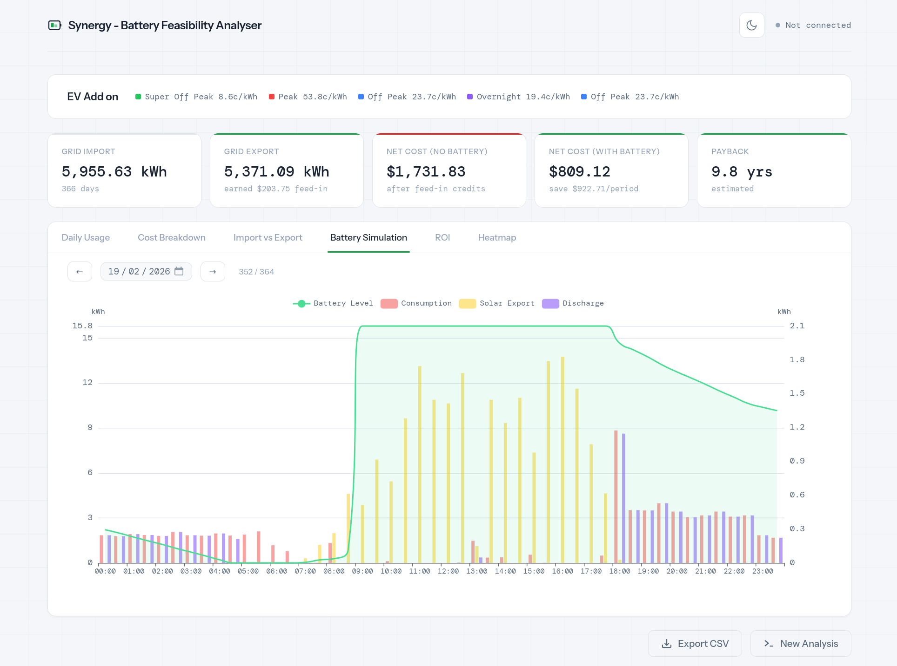

# Synergy Battery Feasibility Analyser

Analyse your [Synergy](https://www.synergy.net.au/) (Western Australia) electricity usage data to determine whether a home battery is financially worthwhile.

<p align="center">
  
</p>

## Features

- **Synergy API integration** — Fetches 12 months of half-hourly interval data directly from Synergy's self-serve portal via email or SMS OTP authentication
- **Tariff-aware analysis** — Auto-detects your energy plan (EV Add On, Midday Saver, Home Plan A1) or allows fully custom tariff rates and supply charges
- **Battery simulation** — Models half-hourly charge/discharge cycles, charges from solar export, discharges to offset grid import, with optional grid top-up during the cheapest tariff period
- **Feed-in credit accounting** — Calculates DEBS feed-in credits (configurable peak/off-peak rates) and tracks lost credits when the battery captures energy that would otherwise be exported
- **Offline analysis** — Saves raw API responses locally so you can re-run analysis with different parameters without re-authenticating or hitting the Synergy API
- **Light/dark theme** — Toggleable via header button, honours system preference with flash-free page load
- **CSV export** — Download the full interval dataset for use in spreadsheets or other tools
- **Cross-platform** — Standalone binaries for Linux, macOS, and Windows with no dependencies required

## Quick start

1. Download the latest release for your platform from the [Releases](https://github.com/sniereffo/synergy-battery-analyser/releases) page
2. Run the binary — your default browser will open automatically to the app

No installation or dependencies required.

## How it works

1. Enter your premise address (must match your Synergy bill) and verify via email or SMS OTP
2. Select your energy plan or let it auto-detect, and configure battery capacity, date range, and feed-in rates
3. The tool fetches your half-hourly consumption and export data from Synergy (and saves it locally for future use)
4. Each interval is categorised by tariff period and a battery charge/discharge simulation is run
5. Results are presented as summary cards and six interactive charts

## Charts

- **Daily Usage** — Stacked area chart of daily consumption broken down by tariff period (peak, off-peak, super off-peak, overnight) with solar export overlay. Includes a zoom slider for navigating the full date range.
- **Cost Breakdown** — Daily cost in dollars split by tariff period, showing the financial impact of each rate tier over time.
- **Import vs Export** — Grid import and grid export as overlaid line charts across the full analysis period, useful for spotting seasonal generation and consumption patterns.
- **Battery Simulation** — Per-day view with a date picker to jump to any day. Shows battery state of charge (left axis) alongside half-hourly consumption, solar export, and battery discharge bars (right axis).
- **ROI** — Cumulative savings curve over the analysis period. If a battery cost is provided, shows the breakeven point and estimated payback period.
- **Heatmap** — Hour-of-day vs date grid showing consumption intensity. Highlights usage patterns across time of day and season.

## Development

Requires Python 3.14+ and [uv](https://docs.astral.sh/uv/).

```bash
# Run the dev server
uv run uvicorn synergy_analyser.main:app --host 127.0.0.1 --port 8000

# Run tests
uv run pytest -v

# Build standalone binary
uv run --group dev pyinstaller synergy-battery-analyser.spec
```

## Data notes

- `kwHalfHourlyValues` from the Synergy API is in **kW** (power) — the tool converts to kWh by multiplying by 0.5
- `kwhHalfHourlyValuesGeneration` is grid **export**, not total solar generation — already in kWh
- Feed-in rates default to DEBS: 10 c/kWh peak (3pm–9pm), 2 c/kWh off-peak

## License

This project is licensed under the [Elastic License 2.0](LICENSE).
